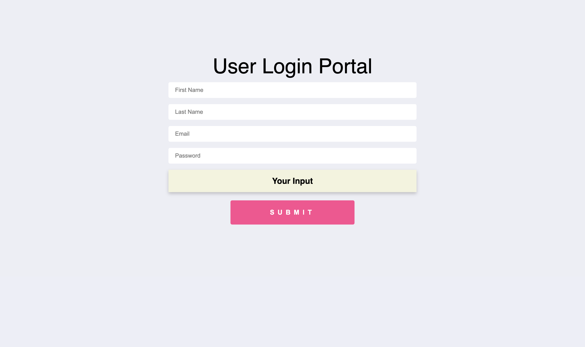
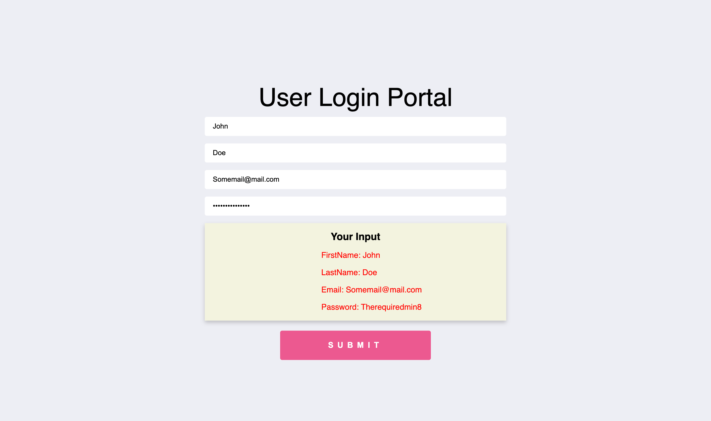

# User login page with react-hook-form
---

### Author Links

👋 Hello there, I'm Joe Debrah

✅ [Check out my other Web Development portfolio's here on Github](https://github.com/JoeDebrah).

---
---

🚀 Check out my Linkedin below:

- [Github](https://github.com/JoeDebrah)
- [LinkedIn](https://www.linkedin.com/in/joe-debrah-953972264/)

---

### Description

🛠️ This is an interesting project i built with the help of the resources available of the react-hook-form website. It is a simple website to mimick a user login portal/page and was largely built with react-hook-form. Zod validation will be impleented in the future.

---
---

🌅 [Check the preview_screenshots for a preview of the site](preview_screenshots) for this repository.

Initial

On Submit

---
---
### 📚 Website References
- 🔗 [react-hook-form Official Website](https://react-hook-form.com/)
---

## Getting Started

First, run npm install:

```bash
npm install
# then
npm start
```

Open [http://localhost:3000](http://localhost:3000) with your browser to see the result.

